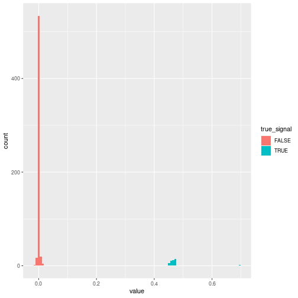
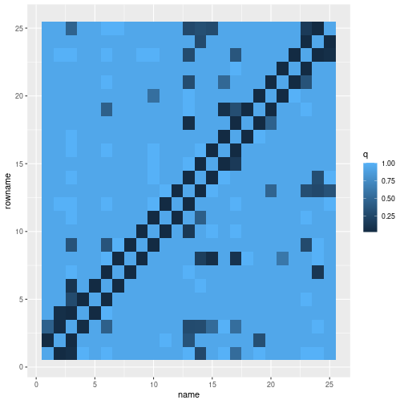

```r
library("magrittr")
library("knockoff")
library("rlookc")
library("ggplot2")
```

This vignette demonstrates basic usage of rlookc for structure learning with knockoffs. 

First, we generate data from a simple chain-like hierarchical model. 


```r
set.seed(0)
p = 25
X = matrix(NA, ncol = p, nrow = 1e4)
X[,1] = rnorm(1e4)
for(k in 2:p){
  X[,k] = rnorm(1e4)
  if(k-100 < 4){
    X[,k] = (X[,k] + X[,k-1]) / sqrt(2)
  }
}
```

This command generates knockoff statistics from regression of each variable on all others.


```r
Sigma = cov(X)
mu = rep(0, ncol(X))
stats = rlookc::create__looks( X, mu = mu, Sigma = Sigma, output_type = "statistics")
```

The above function call combines two steps that in real applications ought to be conducted and examined separately. 
 
 - First, it splits the D by D structure learning problem into D separate regression problems, generating knockoffs for each regression. These knockoffs involve distributional assumptions that you should check against real data using the techniques in the calibration vignette. 
 - Second, the above code computes the LASSO path for each regression problem, comparing the penalty at which each feature enters to the penalty at which its knockoff enters. Other statistics can be used instead of the LASSO penalty at entry -- for example, you could use variable importance from random forests if random forests are better suited to your application. You can do this using the `statistic` arg, for example setting `statistic = knockoff::stat.random_forest`.
 
The results from this analysis should be symmetric about 0, except for the signals of interest. To check, we can tidy the output and make a plot. 


```r
stats_tidy = matrix(0, p,p)
for(k in 1:p){
  stats_tidy[-k, k] = stats[[k]]
}
stats_tidy = stats_tidy %>% 
  as.data.frame %>% 
  set_colnames(1:p) %>%
  set_rownames(1:p) %>%
  tibble::rownames_to_column("rowname") %>%
  tidyr::pivot_longer(cols = !matches("rowname")) %>%
  dplyr::mutate(rowname = as.integer(rowname), name = as.integer(name)) %>%
  dplyr::mutate(true_signal = abs(rowname - name) == 1)
ggplot(stats_tidy) + geom_histogram(aes(x = value, fill = true_signal), bins = 100)
```



Finally, to control the FDR, use `calibrate__getQvals`. 


```r
stats_tidy$q = rlookc::calibrate__getQvals(stats_tidy$value)
stats_tidy %<>% dplyr::arrange(q)
stats_tidy$observed_fdr = cumsum(!stats_tidy$true_signal) / (1:(p^2))
ggplot(stats_tidy) + geom_tile(aes(x = name, y=  rowname, fill = q))
```



```r
ggplot(stats_tidy) + 
  geom_point(aes(x = q, y=  observed_fdr), color = "blue") + 
  geom_abline(intercept=0, slope=1)
```


