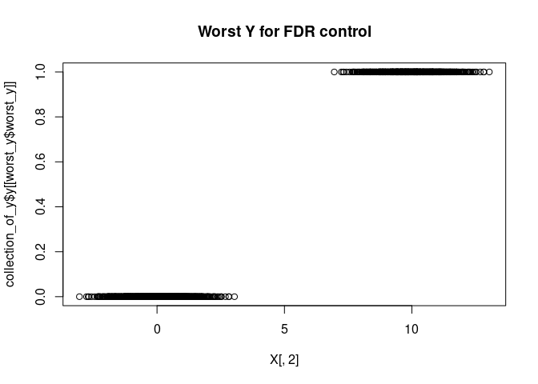

This vignette demonstrates the new features of our package that are
related to checking FDR calibration and model assumptions.

``` r
library("magrittr")
library("ggplot2")
```

Here are some good and bad knockoffs to start with.

``` r
set.seed(0)
make_bimodal = function(X) rbind(X, X + 10)
X = rnorm(1e4) %>% matrix(ncol = 10)
good_knockoffs = knockoff::create.second_order(X)
X %<>% make_bimodal
good_knockoffs %<>% make_bimodal
bad_knockoffs = knockoff::create.second_order(X)
```

### Simulating Y

Using `calibrate__simulateY`, you can simulate from any P(Y\|X) and
check any set of knockoffs you generate. It looks conservative on good
knockoffs and anticonservative on bad knockoffs.

``` r
calibration_check = rlookc::calibrate__simulateY(X, good_knockoffs)
```

    ## Warning in rlookc::calibrate__simulateY(X, good_knockoffs): More simulations than knockoffs. Knockoffs will be recycled.


``` r
calibration_check2 = rlookc::calibrate__simulateY(X, bad_knockoffs)
```

    ## Warning in rlookc::calibrate__simulateY(X, bad_knockoffs): More simulations than knockoffs. Knockoffs will be recycled.


The choice of P(Y\|X) has a big effect on the results. When E\[Y\|X\] is
linear, this diagnostic has almost no power, as you might expect if you
know a lot about fixed-X knockoffs. This is shown in
`calibration_check3` below. We try to choose a sensible family. The
default is step functions of individual features, indicating when they
cross 0. But, you can choose anything and provide it as the FUN
argument.

Below, we specify a linear function to demonstrate how the diagnostic
loses power.

``` r
calibration_check3 = rlookc::calibrate__simulateY(X, bad_knockoffs, FUN = function(x) 2*x)
```

    ## Warning in rlookc::calibrate__simulateY(X, bad_knockoffs, FUN = function(x) 2 * : More simulations than knockoffs. Knockoffs will be recycled.


You can see the difference more easily if we put all the calibration
plots on the same window.

``` r
data.frame( targeted_fdr = calibration_check$calibration$targeted_fdrs, 
            good_knockoffs = calibration_check$calibration$fdr %>% colMeans, 
            bad_knockoffs = calibration_check2$calibration$fdr %>% colMeans, 
            bad_knockoffs_linear_Y = calibration_check3$calibration$fdr %>% colMeans) %>%
  tidyr::pivot_longer(cols = 2:4) %>%
  ggplot() + 
  geom_point(aes(x = targeted_fdr, y = value, color = name, shape = name)) + 
  ggtitle("Calibration") + 
  geom_abline(a = 0, b = 1)+
  xlab ("Targeted FDR") + 
  ylab( "Observed FDR")
```

    ## Warning: Ignoring unknown parameters: a, b


You can use `calibrate__chooseDiverseY` and `calibrate__findWorstY` to
try to search more thoroughly for a worst-case P(Y\|X).
`calibrate__findWorstY` will split the data, searching for the worst
P(Y\|X) in one half and checking calibration in the other half.

``` r
collection_of_y = rlookc::calibrate__chooseDiverseY(X, n_quantiles = 5)
worst_y = rlookc::calibrate__findWorstY(X, bad_knockoffs,
                                       y = collection_of_y$y,
                                       ground_truth = collection_of_y$ground_truth)
```


Once these have run, you can compare the worst-case Y to another Y or
otherwise try to determine informative properties of the worst-case Y.

``` r
collection_of_y$ground_truth[[worst_y$worst_y]]
```

    ## [1] 4

``` r
cor( X, collection_of_y$y[[worst_y$worst_y]])
```

    ##            [,1]
    ##  [1,] 0.9806746
    ##  [2,] 0.9793088
    ##  [3,] 0.9822847
    ##  [4,] 0.9817105
    ##  [5,] 0.9799441
    ##  [6,] 0.9799190
    ##  [7,] 0.9816341
    ##  [8,] 0.9812053
    ##  [9,] 0.9803461
    ## [10,] 0.9804713

``` r
cor( bad_knockoffs, collection_of_y$y[[worst_y$worst_y]])
```

    ##            [,1]
    ##  [1,] 0.9726156
    ##  [2,] 0.9730999
    ##  [3,] 0.9755866
    ##  [4,] 0.9758989
    ##  [5,] 0.9725183
    ##  [6,] 0.9736956
    ##  [7,] 0.9729186
    ##  [8,] 0.9727340
    ##  [9,] 0.9737045
    ## [10,] 0.9725155

``` r
plot(X[,2], collection_of_y$y[[worst_y$worst_y]], main = "Worst Y for FDR control")
```



``` r
plot(X[,2], collection_of_y$y[[6]], main = "Choice of Y that is not as bad")
```


### Testing exchangeability

Using `calibrate__KNNTest`, you can check exchangeability for any set of
knockoffs you generate. This test is less customizeable than the above
but we find it is often much more sensitive. It is sensitive to any
deviation from exchangeability without the need for a careful choice of
P(Y\|X).

``` r
set.seed(0)
X = rnorm(1e4) %>% matrix(ncol = 10)
A = rnorm(1e2) %>% matrix(ncol = 10) %>% add(1) # to induce known correlation across variables
X = X %*% A
good_knockoffs = knockoff::create.gaussian(X, mu = 0, Sigma = t(A) %*% A)
bad_knockoffs = apply(X, 2, sample)
rlookc::calibrate__KNNTest(X, good_knockoffs)[2:3]
```

    ## $prop_not_swapped
    ## [1] 0.5022
    ## 
    ## $p_value
    ## [1] 0.2668874

``` r
rlookc::calibrate__KNNTest(X, bad_knockoffs)[2:3]
```

    ## $prop_not_swapped
    ## [1] 0.75715
    ## 
    ## $p_value
    ## [1] 0

You can sometimes pinpoint outliers by choosing specific data points
that have too few swapped neighbors.

``` r
X[1:50,1:5] = -100
rlookc::calibrate__KNNTest(X, good_knockoffs, n_neighbors = 100)$prop_not_swapped_per_observation %>%
  head(100) %>%
  plot
```


The conservative action to take is to use exact dupes of the data for
any observations you think don’t fit the model for P(X). This will
restore exchangeability, possibly with a loss of power.

``` r
good_knockoffs_outlier_dupe = good_knockoffs
good_knockoffs_outlier_dupe[1:50,] = X[1:50,]
rlookc::calibrate__KNNTest(X, good_knockoffs_outlier_dupe, n_neighbors = 100)$prop_not_swapped_per_observation %>%
  head(100) %>%
  plot
```


