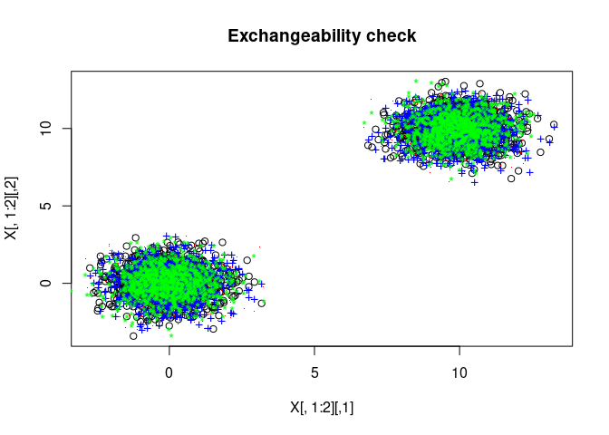
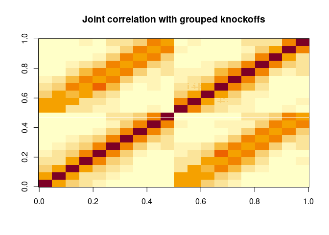
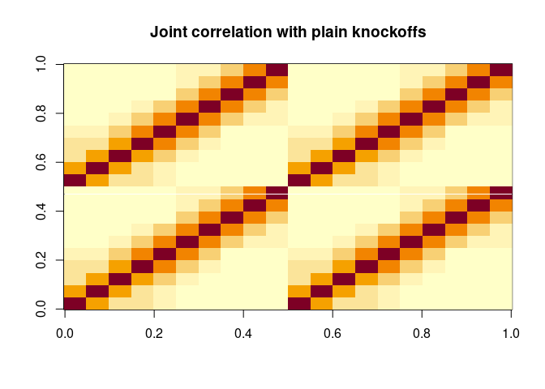

This vignette demonstrates the new features of our software that allow
construction of knockoffs in various ways that either have not been
described before or have been described without open-source code:

-   fast leave-one-out knockoffs (LOOKs)
-   Gaussian knockoffs with p>n
-   Gaussian mixture model knockoffs
-   grouped Gaussian model-X knockoffs

``` r
library("magrittr")
set.seed(0)
```

### Leave-one-out knockoffs (LOOKs)

LOOKs are for structure learning, similar to graphical LASSO. 
Just like graphical LASSO, you need to run D separate regressions where D is the dimension of each observation in your dataset.
To run knockoff-based variable selection D times, you need to generate D sets of knockoffs, each missing one variable.
This gets expensive, so we used linear algebra tricks to speed it up.

You can use our code like this to generate leave-one-out knockoffs fast. This code creates a list
of matrices where element k contains knockoffs for X\[,-k\].

``` r
looks_explicit  = rlookc::create__looks(matrix(rnorm(1e4), nrow = 1e2), mu = 0, Sigma = diag(100), output_type = "knockoffs")
dim(looks_explicit[[6]])
```

    ## [1] 100  99

You can also generate leave-one-out knockoffs with low memory footprint.
These are stored using an algebraic decomposition: a typical set of knockoffs generated with no variables left
out, plus a set of low-rank updates to correct them one by one.

``` r
looks = rlookc::create__looks(matrix(rnorm(1e4), nrow = 1e2), mu = 0, Sigma = diag(100), output_type = "knockoffs_compact")
names(looks)
```

    ## [1] "knockoffs"    "updates"      "groups"       "vars_to_omit"

``` r
dim(looks$knockoffs) # The full knockoffs
```

    ## [1] 100 100

``` r
lapply(looks$updates[[1]], dim) # The low-rank updates
```

    ## $mean_update_left
    ## [1] 100   1
    ## 
    ## $mean_update_right
    ## [1]  1 99
    ## 
    ## $sqrt_cov_update
    ## [1]  1 99
    ## 
    ## $random_update
    ## [1] 100   1

You can save them to disk in a compact form and load them later.

``` r
rlookc::saveLoad__saveCompactLooks(looks, "demo_compact_looks")
looks = rlookc::saveLoad__loadCompactLooks("demo_compact_looks")
# Clean up the files so the vignette has no side effects
unlink("demo_compact_looks", recursive = T)
```

You can reconstitute the compact LOOKs in a more immediately usable
form. To save memory, you can do this for one variable at a time. For
example, this will give you Gaussian knockoffs for X\[,-17\].

``` r
looks_just_one = rlookc::saveLoad__formOneLook(looks$knockoffs,
                                              vars_to_omit = looks$vars_to_omit,
                                              updates = looks$updates,
                                              k = 17)
dim(looks_just_one)
```

    ## [1] 100  99

``` r
# Or you can do them all at once, if you have the RAM for it.
looks_explicit = rlookc::saveLoad__formAllLooks(looks$knockoffs,
                                               vars_to_omit = looks$vars_to_omit,
                                               updates = looks$updates)
length(looks_explicit)
```

    ## [1] 100

``` r
sapply(looks_explicit, dim)
```

    ##      [,1] [,2] [,3] [,4] [,5] [,6] [,7] [,8] [,9] [,10] [,11] [,12] [,13] [,14]
    ## [1,]  100  100  100  100  100  100  100  100  100   100   100   100   100   100
    ## [2,]   99   99   99   99   99   99   99   99   99    99    99    99    99    99
    ##      [,15] [,16] [,17] [,18] [,19] [,20] [,21] [,22] [,23] [,24] [,25] [,26]
    ## [1,]   100   100   100   100   100   100   100   100   100   100   100   100
    ## [2,]    99    99    99    99    99    99    99    99    99    99    99    99
    ##      [,27] [,28] [,29] [,30] [,31] [,32] [,33] [,34] [,35] [,36] [,37] [,38]
    ## [1,]   100   100   100   100   100   100   100   100   100   100   100   100
    ## [2,]    99    99    99    99    99    99    99    99    99    99    99    99
    ##      [,39] [,40] [,41] [,42] [,43] [,44] [,45] [,46] [,47] [,48] [,49] [,50]
    ## [1,]   100   100   100   100   100   100   100   100   100   100   100   100
    ## [2,]    99    99    99    99    99    99    99    99    99    99    99    99
    ##      [,51] [,52] [,53] [,54] [,55] [,56] [,57] [,58] [,59] [,60] [,61] [,62]
    ## [1,]   100   100   100   100   100   100   100   100   100   100   100   100
    ## [2,]    99    99    99    99    99    99    99    99    99    99    99    99
    ##      [,63] [,64] [,65] [,66] [,67] [,68] [,69] [,70] [,71] [,72] [,73] [,74]
    ## [1,]   100   100   100   100   100   100   100   100   100   100   100   100
    ## [2,]    99    99    99    99    99    99    99    99    99    99    99    99
    ##      [,75] [,76] [,77] [,78] [,79] [,80] [,81] [,82] [,83] [,84] [,85] [,86]
    ## [1,]   100   100   100   100   100   100   100   100   100   100   100   100
    ## [2,]    99    99    99    99    99    99    99    99    99    99    99    99
    ##      [,87] [,88] [,89] [,90] [,91] [,92] [,93] [,94] [,95] [,96] [,97] [,98]
    ## [1,]   100   100   100   100   100   100   100   100   100   100   100   100
    ## [2,]    99    99    99    99    99    99    99    99    99    99    99    99
    ##      [,99] [,100]
    ## [1,]   100    100
    ## [2,]    99     99

(We also have code to load LOOKs into Python and Julia and reconstitute
them there. It is minimal but it is unit-tested. As input, it takes the
files saved by `saveLoad.saveCompactLooks`.)

Another way to save memory is to output feature-importance statistics
immediately upon creating LOOKs. It assumes you’re doing structure
learning, so Y is set equal to the omitted feature. The argument
vars_to_omit indicates which variables to leave out.

The reason each output has length 99 is that we are doing structure learning on a set of 100 variables, and for each variable, there are 99 possible neighbors. 

``` r
symmetric_stats = rlookc::create__looks(matrix(rnorm(1e4), nrow = 1e2), mu = 0,
                                        Sigma = diag(100),
                                        vars_to_omit = 1:10,
                                        output_type = "statistics")
```

    ## Warning: doMC is not installed. Without parallelization, the statistics will be
    ## slower to compute

    ## Warning: doMC is not installed. Without parallelization, the statistics will be
    ## slower to compute

    ## Warning: doMC is not installed. Without parallelization, the statistics will be
    ## slower to compute

    ## Warning: doMC is not installed. Without parallelization, the statistics will be
    ## slower to compute

    ## Warning: doMC is not installed. Without parallelization, the statistics will be
    ## slower to compute

    ## Warning: doMC is not installed. Without parallelization, the statistics will be
    ## slower to compute

    ## Warning: doMC is not installed. Without parallelization, the statistics will be
    ## slower to compute

    ## Warning: doMC is not installed. Without parallelization, the statistics will be
    ## slower to compute

    ## Warning: doMC is not installed. Without parallelization, the statistics will be
    ## slower to compute

    ## Warning: doMC is not installed. Without parallelization, the statistics will be
    ## slower to compute

``` r
sapply(symmetric_stats, length)
```

    ##  [1] 99 99 99 99 99 99 99 99 99 99

### High-dimensional, mixture-model, and grouped knockoffs

We also have a couple of other features for scalable knockoff
construction. You can generate high-dimensional Gaussian knockoffs.

``` r
rather_wide_knockoffs = rlookc::create__highDimensionalKnockoffs( matrix(rnorm(1e7), nrow = 1e2) )
dim(rather_wide_knockoffs)
```

    ## [1]    100 100000

You can generate mixture-model knockoffs.

``` r
X = matrix(rnorm(1e4), nrow = 1e3)
X = rbind(X, matrix(rnorm(1e4), nrow = 1e3) + 10)
library("mclust")
```

    ## Package 'mclust' version 5.4.10
    ## Type 'citation("mclust")' for citing this R package in publications.

``` r
fitted_mixture_model = mclust::Mclust(X)
mixture_model_knockoffs = rlookc::create__gaussianMixtureKnockoffs(
  X = X,
  do_high_dimensional = F,
  mus = fitted_mixture_model$parameters$mean %>%
    as.data.frame() %>%
    as.list(),
  sigmas = list(
    fitted_mixture_model$parameters$variance$Sigma,
    fitted_mixture_model$parameters$variance$Sigma
  ),
  posterior_probs = fitted_mixture_model$z
)
```

Here’s a quick check of the knockoff exchangeability condition, just to 
demonstrate that the mixture model knockoffs are constructed correctly. Red is
the original data and blue and green each have a different variable
swapped with its knockoffs.

``` r
plot(X[,1:2], col = "black", main = "Exchangeability check")
points(mixture_model_knockoffs[,1:2], col = "red", pch = ".")
points(X[,1], mixture_model_knockoffs[,2], col = "blue", pch = "+")
points(mixture_model_knockoffs[,1], X[,2], col = "green", pch = "*")
```



You can even generate grouped knockoffs (but this capability is
experimental).

``` r
# Start with nearly-duplicated features
my_groups = lapply(1:10, function(k) ((k-1)*10) + 1:10)
my_duplicated_features = matrix(0, nrow = 1e3, ncol = 1e2)
most_of_the_info = 0
for(i in 1:10){
  most_of_the_info = rnorm(1000) + 0.5*most_of_the_info
  for(j in 1:10){
    my_duplicated_features[,my_groups[[i]][[j]]] = most_of_the_info + 0.001*rnorm(1000)
  }
}
# Use the same groups for knockoff construction
grouped_knockoffs = rlookc::create__gaussianKnockoffs(
  my_duplicated_features,
  groups = my_groups,
  method = "group"
)
# Make non-grouped knockoffs for comparison
plain_knockoffs =  knockoff::create.second_order(
  my_duplicated_features
)
```

Grouped knockoffs are much less correlated with the original features.
Power will be correspondingly higher. You can see this in the joint
correlation matrix in the values that are off the diagonal but parallel to
it.

``` r
image(cor(cbind(my_duplicated_features, grouped_knockoffs)),
      main = "Joint correlation with grouped knockoffs")
```



``` r
image(cor(cbind(my_duplicated_features, plain_knockoffs)),
      main = "Joint correlation with plain knockoffs")
```


